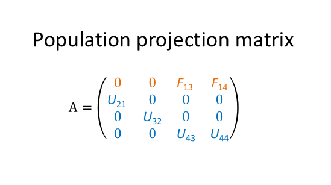
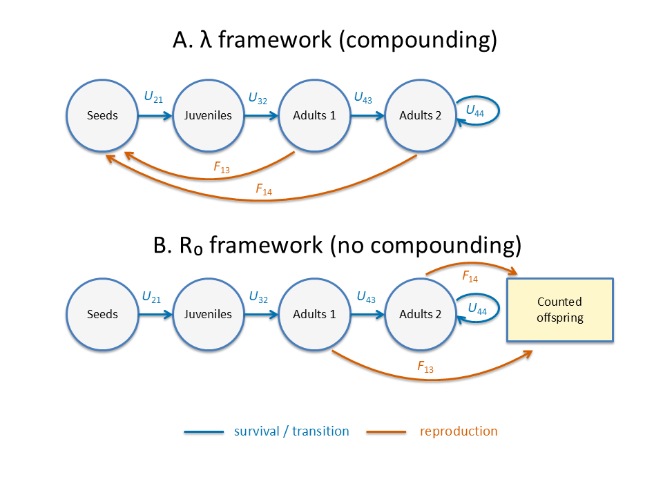

**ORCID:** <https://orcid.org/0000-0003-0761-3005>

```{r setup, include=FALSE}
knitr::opts_chunk$set(
  collapse = TRUE,
  comment = "#>"
)
```

## Overview
Matrix population models (MPMs) are widely used to describe population dynamics,
and large demographic databases such as COMPADRE and COMADRE now make it possible
to study life-history patterns across a wide range of taxa. However, these models
often differ substantially in their structure: they may be constructed with
different projection intervals, life-cycle stage definitions, and levels of
complexity. Such differences can make models difficult to compare directly,
even when they describe similar populations. Aggregation methods address this
problem by combining stages while preserving key demographic properties of the
original model. The `mpmaggregate` package provides tools for reducing the
dimensionality of MPMs under different demographic frameworks, allowing
finer-scale models to be compared with coarser models. For example, a 12-stage
life-cycle model can be reduced to a simpler 3-stage model that still captures
the essential demographic behavior of the population.

### Demographic frameworks: \(\lambda\) and \(R_0\)

Aggregation methods can be defined by the demographic quantities they are designed to 
preserve. In matrix population models, two commonly used measures of growth
are the population growth rate \(\lambda\) and the net reproductive rate \(R_0\).
These quantities describe different aspects of population dynamics, and therefore
preserving them leads to different frameworks for aggregation.

The quantity \(\lambda\) is the dominant eigenvalue of the population projection matrix and 
describes stable population growth per time step (Caswell, 2001). The quantity 
\(R_0\) measures expected lifetime reproductive output and is interpreted 
from a cohort-based perspective (Caswell, 2011). In MPMs, \(R_0\) is calculated from 
the next-generation matrix \(F(I-U)^{-1}\) (Diekmann et al., 1990; Caswell, 2001).

Although \(\lambda\) and \(R_0\) share the same population growth threshold, with 
\(\lambda > 1\) if and only if \(R_0 > 1\), they summarize different aspects 
of demography: \(\lambda\) emphasizes population trajectories through time, 
whereas \(R_0\) emphasizes lifetime reproductive pathways through the life cycle 
(Cushing & Yicang, 1994; de-Camino-Beck & Lewis, 2007). The \(\lambda\) framework 
describes population growth through repeated time-step projection of the entire 
population, so reproduction is incorporated into future population states and 
therefore compounds over time. By contrast, the \(R_0\) framework follows a 
single cohort through the life cycle and counts the offspring produced by that 
cohort, but those offspring are not themselves projected forward. In this sense, 
the \(\lambda\) framework includes compounding reproduction, whereas the 
\(R_0\) framework does not (see Figure 1).

This distinction matters for aggregation, because a method that preserves 
demographic properties in one framework will not generally preserve those same
properties in the other. Aggregation in the \(\lambda\) framework is appropriate 
when the goal is to preserve stable population growth and related population-based 
demographic quantities, whereas aggregation in the \(R_0\) framework is appropriate 
when the goal is to preserve lifetime reproductive output and related cohort-based 
demographic quantities.
<!--display of the actual population projection matrix (4x4) -->
```{r projection matrix, echo=FALSE, out.width="50%", fig.cap="  "}

```
<!--figure showing life-cycle representation in different frameworks -->
```{r lambda-r0-figure, echo=FALSE, out.width="90%", fig.cap="Figure 1. Interpretation of λ and R0 frameworks"}

```

### Aggregation criteria: standard and elasticity-consistent

Within each framework, users may choose between **standard aggregation**, which maintains 
consistency of the stable population growth rate and stable stage distribution 
(Hooley, 2000; Salguero-Gómez & Plotkin, 2010), and **elasticity-consistent aggregation**, 
which additionally maintains consistency in reproductive values and elasticities 
(Bienvenu et al., 2017). These aggregators are applied in two forms: general-to-general
MPM aggregation and Leslie-to-Leslie MPM aggregation (Hinrichsen, 2023; 
Hinrichsen et al., 2026). 

When applying general-to-general MPM aggregation, the projection interval of the aggregated
matrix does not change. But when applying Leslie-to-Leslie MPM aggregation, the
projection interval changes because, in a Leslie MPM, the projection interval is equal
to the age-class width, which increases with the level of aggregation
(Hinrichsen et al., 2026).

### Package functions
Two primary functions are provided. The function `mpm_aggregate()` aggregates general 
stage-structured MPMs (Caswell, 2001) to coarser stage classifications, whereas 
leslie_aggregate() is designed specifically for age-structured Leslie matrices 
(Leslie, 1945) and returns a lower-dimensional Leslie matrix.  In both cases, 
aggregation is accompanied by an effectiveness metric that quantifies the degree 
of agreement between the aggregated and original models. Values close to 1 indicate 
minimal aggregation error and strong agreement, whereas smaller values reflect 
increasing approximation.

Together, these tools make it possible to simplify complex matrix models, compare
models constructed at different resolutions, and explore how demographic conclusions 
depend on the level of aggregation.

## Loading packages

We begin by loading the `mpmaggregate` package, which provides the functions used 
throughout this vignette for aggregating matrix population models under the \(\lambda\) 
and \(R_0\) demographic frameworks. The package `expm` is used to raise a matrix
to a power, `knitr` is used for report generation, and `kableExtra` is used for
table formatting.

```{r}
library(mpmaggregate)
library(expm)
library(knitr)
library(kableExtra)
```

## Aggregating general-to-general MPM

```{r table-preserved, echo=FALSE, results='asis'}

preserved_tbl <- data.frame(
  Framework = c("lambda", "lambda", "R0", "R0"),
  Criterion = c("standard", "elasticity-consistent", "standard", "elasticity-consistent"),
  Preserved = c(
    "<em>λ</em> (stable growth rate)<br>
     Stable stage distribution<br>
     Interstage flow matrix",

    "<em>λ</em> (stable growth rate)<br>
     Stable stage distribution<br>
     Reproductive values<br>
     Elasticities of <em>λ</em><br>
     Generation time (<em>T</em><sub>a</sub>)",

    "<em>R</em><sub>0</sub> (net reproductive rate)<br>
     Cohort stable stage distribution<br>
     Cohort interstage flow matrix",

    "<em>R</em><sub>0</sub> (net reproductive rate)<br>
     Cohort stable stage distribution<br>
     Cohort reproductive values<br>
     Elasticities of <em>R</em><sub>0</sub><br>
     Cohort generation time (<em>T</em><sub>c</sub>)"
  ),
  check.names = FALSE
)

knitr::kable(
  preserved_tbl,
  format = "html",
  escape = FALSE,
  align = c("l", "l", "l"),
  col.names = c("Framework", "Criterion", "Consistent Demographic Quantities"),
caption = paste0(
  "<strong>Table 1.</strong> Demographic quantities that remain consistent under ",
  "<code>mpm_aggregate()</code> in the <em>λ</em> and <em>R</em><sub>0</sub> frameworks ",
  "for both the standard and elasticity-consistent aggregation criteria. ",
  "Under the <em>λ</em> framework, aggregation maintains consistency in stable ",
  "growth properties, whereas under the <em>R</em><sub>0</sub> framework it maintains ",
  "consistency in cohort-based reproductive quantities. ",
  "Interstage flow weights the columns of <strong>A</strong> by their respective ",
  "stable stage densities (Yokomizo et al. 2024). ",
  "Here, “cohort” denotes the <em>R</em><sub>0</sub>-framework analogues of the ",
  "corresponding <em>λ</em>-framework demographic quantities. ",
  "Notice the symmetry between the <em>λ</em> and <em>R</em><sub>0</sub> frameworks."
)
) |>
  kable_styling(
    full_width = FALSE,
    bootstrap_options = c("striped", "condensed")
  ) |>
  column_spec(3, width = "7cm") |>
  row_spec(0, extra_css = "border-bottom: 2px solid black;") |>
  footnote(
    general_title = "",
    general = paste0(
      "<div style='border-top: 1px solid black; padding-top: 6px;'>",
      "<span style='font-size: 90%;'>",
      "<strong>Note.</strong> <code>mpm_aggregate()</code> retains the projection ",
      "interval of the original matrix population model.",
      "</span></div>"
    ),
    footnote_as_chunk = TRUE,
    escape = FALSE
  )
```

To illustrate general-to-general MPM aggregation, we begin with a simple 3x3 stage
structured \( \mathbf{A} \) COMPADRE MatrixID = 247940 (Salguero‐Gómez et al., 2015), for a
Marula (*Sclerocarya	birrea*) population, with a seedling, juvenile, and adult stage
(Emanuel et al., 2005). Here, the projection interval is 1 year, and is unchanged by
general-to-general MPM aggregation.

We define a grouping of stages using the object `groups`, which specifies how the 
original stages are combined into broader classes. In this example, the first stage 
is left unchanged, while the second and third stages are aggregated into a single 
group. Internally, this grouping is converted to a partition matrix using `mpm_partition()`, 
which is then used to construct the aggregated model.

```{r}
# Example matrices used in the general-to-general MPM aggregation examples below
#population projection matrix for Sclerocarya	birrea
#MatrixID = 247940

# Not run: requires Rcompadre and internet access

#these matrices can be retrieved with:
#library(Rcompadre)
#compadre <- cdb_fetch("compadre")
#mpm <- compadre[compadre$MatrixID == 247940, ]
#A <- matA(mpm)[[1]]
#U <- matU(mpm)[[1]]
#F <- matF(mpm)[[1]]


A <- matrix(
  c(0.0, 0.0000, 12.46,
    0.4, 0.9160,  0.00,
    0.0, 0.0371,  0.99),
  nrow = 3,
  byrow = TRUE
)
#survival/transitions matrix
U <- matrix(
  c(0.0, 0.0000,  0.00,
    0.4, 0.9160,  0.00,
    0.0, 0.0371,  0.99),
  nrow = 3,
  byrow = TRUE
)
#reproduction matrix
F <- matrix(
  c(0.0, 0.0000, 12.46,
    0.0, 0.0000,  0.00,
    0.0, 0.0000,  0.00),
  nrow = 3,
  byrow = TRUE
)

# Stage aggregation used in later examples:
# group vegetative + reproductive stages together,
# leaving the seedling stage separate
groups <- list(
  c(1),
  c(2,3)
)
```

The object `groups` defines how stages are aggregated.
Internally, this is converted to a partition matrix using
`mpm_partition()`.


### Lambda framework: standard aggregation

We first aggregate in the \(\lambda\) framework using **standard aggregation** 
(Hooley, 2000; Salguero-Gomez & Plotkin, 2010). This option is designed to maintain 
consistency in the dominant eigenvalue (\(\lambda\)) and the corresponding stable stage distribution, 
while producing a lower-dimensional matrix  consistent with the grouping defined 
in `groups`. Consistency of interstage flows is also maintained, and this condition 
can be used to derive the standard aggregator (Hinrichsen et al., 2026). 

The call below returns (i) the aggregated projection matrix and (ii) an effectiveness 
value \(\rho^2\), which summarizes how closely the aggregated model reproduces the 
dynamics of the original model. Values of \(\rho^2\) close to 1 indicate near-perfect 
agreement.

```{r}

# General-to-general MPM aggregation
# in the lambda framework, standard aggregation
res_lambda_std <- mpm_aggregate(
  matA = A,
  groups = groups,
  framework = "lambda",
  criterion = "standard"
)

# Aggregated projection matrix
res_lambda_std$matA_agg

# Effectiveness of aggregation
res_lambda_std$effectiveness

# ---- Check: lambda consistency ----

# Expected
spectral_radius(A)

# Lambda of aggregated model
spectral_radius(res_lambda_std$matA_agg)

# ---- Check: stable stage distribution consistency ----

# P is the partitioning matrix that groups stages
P <- mpm_partition(groups=groups,n=3)

# w is the stable stage distribution
w <- stable_stage(A=A)

# Expected
c(P%*%w)

# stable stage distribution of aggregated model
w_agg <-stable_stage(res_lambda_std$matA_agg)
w_agg

# ---- Check: interstage flows consistency ----

# Expected
P%*%A%*%diag(w)%*%t(P)

# Interstage flows of aggregated model
res_lambda_std$matA_agg%*%diag(w_agg)
```

### Lambda framework: elasticity-consistent aggregation

Elasticity-consistent aggregation additionally maintains consistency of reproductive 
values. This approach can produce survival probabilities greater than 1 in the aggregated 
matrix (Bienvenu et al. 2017), a behavior that does not occur under standard aggregation. 
Here, consistency of interstage flows is sacrificed in order to maintain consistency 
of the elasticities of (\(\lambda\)) with respect to matrix entries.

```{r}

# General-to-general MPM aggregation
# in the lambda framework, elasticity-consistent aggregation
res_lambda_el <- mpm_aggregate(
  matA = A,
  matF = F,
  matU = U,
  groups = groups,
  framework = "lambda",
  criterion = "elasticity"
)

# Aggregated matrix
res_lambda_el$matA_agg

# Effectiveness of aggregation
res_lambda_el$effectiveness

# ---- Check: lambda consistency ----

# Expected
spectral_radius(A)

# Lambda of aggregated model
spectral_radius(res_lambda_el$matA_agg)

# ---- Check: stable stage distribution consistency ----

# P is the partitioning matrix
P <- mpm_partition(groups=groups,n=3)

# w us the stable stage distribution 
w <- stable_stage(A=A)

# Expected
c(P%*%w)

# Stable stage distribution of aggregated model
stable_stage(res_lambda_el$matA_agg)

# ---- Check: reproductive values consistency ----

# v is reproductive values (dominant left eigenvector)
v = reproductive_values(A)

# Expected
c(solve(P%*%diag(w)%*%t(P))%*%P%*%(w*v))

# Reproductive values of aggregated model
reproductive_values(res_lambda_el$matA_agg)

# ---- Check: elasticities consistency ----

# Elasticity matrix
EA <- mpm_elasticity(matA=A,framework="lambda")$elasticity

# Expected
P%*%EA%*%t(P)

# Elasticities of aggregated model
mpm_elasticity(matA=res_lambda_el$matA_agg,framework="lambda")$elasticity

# ---- Check: generation time consistency ----

# Expected
generation_time(matF=F,matU=U,framework="lambda")$generation_time

# Generation time from aggregated model
generation_time(matF=res_lambda_el$matF_agg,
                matU=res_lambda_el$matU_agg,
                framework="lambda")$generation_time
```
**Notice** that the [2,1] entry, which is survival probability of the  aggregated matrix 
`res_lambda_el$matA_agg` exceeds 1, which is a known difficulty with the elasticity-consistent 
aggregator (Bienvenu et al. 2017). 

### \(R_0\)framework: decomposition of \( \mathbf{A} \)

We now illustrate aggregation under the \(R_0\) framework, which is based on the
decomposition of the population projection matrix into survival and reproduction
components. Rather than working directly with the full projection matrix \( \mathbf{A} \),
aggregation in this framework is performed using the survival matrix \( \mathbf{U} \) and
the fertility matrix \( \mathbf{F} \).

For this example, we use the same life cycle as above, with \( \mathbf{U} \) describing
survival and transitions among stages and \( \mathbf{F} \) describing reproduction. Together,
these matrices satisfy \( \mathbf{A} = \mathbf{U} + \mathbf{F} \)
.


### \(R_0\) framework: standard aggregation

We first apply standard aggregation in the \(R_0\) framework. In this setting,
aggregation is carried out using the survival and reproduction components of the
model and is designed to ensure consistency of the net reproductive rate (\(R_0\)) and its
associated cohort stable stage distribution. Also consistent is the cohort
interstage flow matrix which weights the columns of \( \mathbf{A} \) by their associated
cohort stable stage densities.


As before, the function returns the aggregated projection matrix and an effectiveness
value that summarizes how closely the aggregated model reproduces the demographic
behavior of the original model.

```{r}

# General-to-general MPM aggregation
# in the R0 framework, standard aggregation
res_R0_std <- mpm_aggregate(
  matU = U,
  matF = F,
  groups = groups,
  framework = "R0",
  criterion = "standard"
)

# Aggregated projection matrix
res_R0_std$matA_agg

# Effectiveness of aggregation
res_R0_std$effectiveness

# ---- Check: R0 consistency ----

# Expected
spectral_radius(F%*%solve(diag(3)-U))

# R0 from aggregated matrix
spectral_radius(res_R0_std$matF_agg%*%solve(diag(2)-res_R0_std$matU_agg))

# ---- Check: cohort stable stage distribution consistency ----

# w is the cohort stable stage distribution from a next generation matrix
w <- stable_stage(solve(diag(3)-U)%*%F)

# Expected for consistency
c(P%*%stable_stage(solve(diag(3)-U)%*%F))

# Aggregated cohort stable stage distribution
w_agg <- stable_stage(solve(diag(2)-res_R0_std$matU_agg)%*%res_R0_std$matF_agg)
w_agg

# ---- Check: cohort interstage flows  consistency ----

# Expected
P%*%A%*%diag(w)%*%t(P)

# Aggregated interstage flows
res_R0_std$matA_agg%*%diag(w_agg)
```


### \(R_0\) framework: elasticity-consistent aggregation

Elasticity-consistent aggregation in the \(R_0\) framework additionally ensures
consistent cohort reproductive values and the elasticities of \(R_0\) with respect to matrix
entries. As in the \(\lambda\) framework, this approach can produce survival
probabilities greater than 1 in the aggregated matrix. This behavior reflects the
constraints imposed by elasticity preservation and does not occur under standard
aggregation or in Leslie-to-Leslie aggregation.

```{r}

# General-to-general MPM aggregation
# in the R0 framework, elasticity-consistent aggregation
res_R0_el <- mpm_aggregate(
  matU = U,
  matF = F,
  groups = groups,
  framework = "R0",
  criterion = "elasticity"
)

# Aggregated projection matrix
res_R0_el$matA_agg

# Effectiveness of aggregation
res_R0_el$effectiveness

# ---- Check: R0 consistency ----

# Expected R0
R0 <- spectral_radius(F%*%solve(diag(3)-U))
R0

# R0 from the aggregated model
spectral_radius(res_R0_el$matF_agg%*%solve(diag(2)-res_R0_el$matU_agg))

# ---- Check: cohort stable stage distribution consistency ----

# Get partitioning matrix
P <- mpm_partition(groups=groups,n=3)

# Construct cohort projection matrix
Aref = F + U*R0

# Cohort stable stage distribution
w <- stable_stage(A=Aref)

# Expected for consistency
c(P%*%w)

# Aggregated cohort projection matrix
Aref_agg = res_R0_el$matF_agg+ R0*res_R0_el$matU_agg

# Aggregated cohort stable stage distribution
stable_stage(Aref_agg)

# ---- Check: cohort reproductive values consistency ----
v = reproductive_values(Aref)

# Expected
c(solve(P%*%diag(w)%*%t(P))%*%P%*%(w*v))

# Cohort reproductive values for aggregated matrix
reproductive_values(Aref_agg)

# ---- Check: elasticities of R0 consistency ----
# Here elasticities are normalized to sum to 1

# Original elasticities
EA <- mpm_elasticity(matF=F,matU=U,framework="R0")$elasticity

# Expected for consistency
P%*%EA%*%t(P)

# Elasticities of R0 from aggregated matrix
mpm_elasticity(matF=res_R0_el$matF_agg,matU=res_R0_el$matU_agg,framework="R0")$elasticity

# ---- Check: cohort generation time consistency ----

# Expected (from original model)
generation_time(matF=F,matU=U,framework="R0")$generation_time

# Cohort generation time from aggregated model
generation_time(matF = res_R0_el$matF_agg, 
                matU = res_R0_el$matU_agg,
                framework="R0")$generation_time
```

## Aggregating Leslie-to-Leslie MPM

```{r table-leslie-preserved, echo=FALSE, results='asis'}
preserved_leslie_tbl <- data.frame(
  Framework = c("lambda", "lambda", "R0", "R0"),
  Criterion = c("standard", "elasticity-consistent", "standard", "elasticity-consistent"),
  Preserved = c(
    "<em>λ</em> (stable growth rate)<br>
     Stable age distribution<br>
     Interstage flow matrix of <strong>A</strong><sup><em>k</em></sup>",

    "<em>λ</em> (stable growth rate)<br>
     Stable age distribution<br>
     Reproductive values<br>
     Elasticities of <em>λ</em><sup><em>k</em></sup> with respect to the entries of <strong>A</strong><sup><em>k</em></sup><br>
     Generation time (<em>T</em><sub>a</sub>) of <strong>A</strong><sup><em>k</em></sup>",

    "<em>R</em><sub>0</sub> (net reproductive rate)<br>
     Cohort stable age distribution<br>
     consistent of <strong>A</strong><sub><em>k</em></sub><sup></sup>",

    "<em>R</em><sub>0</sub> (net reproductive rate)<br>
     Cohort stable age distribution<br>
     Cohort reproductive values<br>
     Elasticities of <em>R</em><sub>0</sub> with respect to <strong>A</strong><sub><em>k</em></sub><sup></sup><br>
     Cohort generation time (<em>T</em><sub>c</sub>) for <strong>A</strong><sub><em>k</em></sub><sup></sup>"
  ),
  check.names = FALSE
)

knitr::kable(
  preserved_leslie_tbl,
  format = "html",
  escape = FALSE,
  align = c("l", "l", "l"),
  col.names = c("Framework", "Criterion", "Consistent Demographic Quantities"),
caption = paste0(
  "<strong>Table 2.</strong> Summary of the demographic properties that remain consistent under ",
  "<code>leslie_aggregate()</code> when reducing a Leslie matrix from dimensionality ",
  "<em>n</em> to <em>m</em>. The quantities the remain consistent depend on both the demographic framework ",
  "(long-term growth under <em>λ</em> or lifetime reproductive output under ",
  "<em>R</em><sub>0</sub>) and the aggregation criterion (standard versus ",
  "elasticity-consistent). The integer <em>k</em> = <em>n</em>/<em>m</em> defines the ",
  "temporal rescaling by aggregating a Leslie model. Quantities in the ",
  "<em>λ</em> framework are defined for <strong>A</strong><sup><em>k</em></sup>, ",
  "while cohort quantities in the <em>R</em><sub>0</sub> framework are defined for ",
  "<strong>A</strong><sub><em>k</em></sub><sup>&dagger;</sup>. Notice the structural symmetry ",
  "between the <em>λ</em> and <em>R</em><sub>0</sub> frameworks."
)
) |>
  kable_styling(
    full_width = FALSE,
    bootstrap_options = c("striped", "condensed")
  ) |>
  column_spec(3, width = "7cm") |>
  row_spec(0, extra_css = "border-bottom: 2px solid black;") |>
  footnote(
    general_title = "",
    general = paste0(
      "<div style='border-top: 1px solid black; padding-top: 6px;'>",
      "<span style='font-size: 90%;'>",
      "<strong>Note.</strong> Aggregation with <code>leslie_aggregate()</code> ",
      "changes the projection interval from Δt to <em>k</em>Δt.<br>",
      "<sup>&dagger;</sup> <strong>A</strong><sub><em>k</em></sub><sup></sup> denotes the <em>k</em>-step-ahead projection matrix ",
      "in the <em>R</em><sub>0</sub> framework.</span></div>"
    ),
    footnote_as_chunk = TRUE,
    escape = FALSE
  )
```

In some applications, it is desirable to aggregate an age-structured Leslie matrix
while retaining its Leslie form (Hinrichsen 2023; Hinrichsen et al., 2026). The 
function `leslie_aggregate()` is designed for this purpose. It aggregates a Leslie 
matrix with fine-grained age classes into a coarser Leslie matrix of dimensionality
`ngroups`.

To illustrate Leslie-to-Leslie MPM aggregation, we begin with a simple 4x4 Leslie matrix 
\( \mathbf{A} \) COMADRE MatrixID = 248187 (Salguero‐Gómez et al., 2016), for a 
fathead minnow (*Pimephales	promelas*) population (Spromberg & Birge, 2005).

```{r}
# New example used for Leslie-to-Leslie aggregation
# These matrices replace the earlier example matrices (A, U, F)
# Leslie population projection matrix for Pimephales promelas (MatrixID = 248187)

# Not run: requires Rcompadre and internet access

# Matrices can be retrieved with:
# library(Rcompadre)
# comadre <- cdb_fetch("comadre",version = "4.23.3.1")
# mpm <- comadre[comadre$MatrixID == 248187, ]
# A <- matA(mpm)[[1]]
# U <- matU(mpm)[[1]]
# F <- matF(mpm)[[1]]


# Leslie population projection matrix
A <- rbind(
  c(0.00, 0.00,  6.00, 62.50),
  c(0.50, 0.00,  0.00,  0.00),
  c(0.00, 0.18,  0.00,  0.00),
  c(0.00, 0.00,  0.12,  0.00)
)

# Reproduction matrix
F <- rbind(
  c(0.00, 0.00,  6.00, 62.50),
  c(0.00, 0.00,  0.00,  0.00),
  c(0.00, 0.00,  0.00,  0.00),
  c(0.00, 0.00,  0.00,  0.00)
)

# Survival/transition matrix
U <- rbind(
  c(0.00, 0.00,  0.00,  0.00),
  c(0.50, 0.00,  0.00,  0.00),
  c(0.00, 0.18,  0.00,  0.00),
  c(0.00, 0.00,  0.12,  0.00)
)

# Partitioning matrix used for the aggregation examples below
# (first two age classes combined, last two combined)
# In practice this matrix is constructed automatically inside leslie_aggregate()
# It is reproduced here only to verify the aggregation results.
P <- rbind(
  c(1,1,0,0),
  c(0,0,1,1)
)

# Dimensions used in the aggregation examples
n <- 4     # dimensionality of the original matrix A
m <- 2     # dimensionality of the aggregated matrix
k <- n / m #(also constructed automatically)
```
  


### Lambda framework: standard aggregation

We first aggregate the Leslie matrix in the \(\lambda\) framework using standard
aggregation (Hinrichsen, 2023). As in the general-to-general case, this approach ensures
consistency of the stable population growth rate (\(\lambda\)) and the stable age distribution,
while producing a Leslie matrix of reduced dimensionality. 
The interstage flow of the aggregated matrix is consistent with that of
\( \mathbf{A}^{k} \).

```{r}

# Leslie-to-Leslie MPM aggregation
# in the lambda framework, standard aggregation
res_leslie_lambda_std <- leslie_aggregate(
  matA = A,
  ngroups = 2,
  framework = "lambda",
  criterion = "standard"
)


# Aggregated Leslie matrix
res_leslie_lambda_std$matAk_agg

# Effectiveness of aggregation
res_leslie_lambda_std$effectiveness

# ---- Check: lambda consistency ----

# Expected lambda
spectral_radius(A)^k

# Lambda of aggregated model
spectral_radius(res_leslie_lambda_std$matAk_agg)

# ---- Check: stable age distribution consistency ----

# Stable age distribution
w <- leslie_stable_age(A=A)

# Expected 
c(P%*%w)

# Aggregated stable age distribution
w_agg <-leslie_stable_age(res_leslie_lambda_std$matAk_agg)
w_agg

# ---- Check: interstage flow consistency ----

# Expected
P%*%(A%^%k)%*%diag(w)%*%t(P)

# Interstage flows from aggregated model
res_leslie_lambda_std$matAk_agg%*%diag(w_agg)
```

**Note.** In this case, the dimensionality of the aggregated matrix (\(m = 2\))
divides the dimensionality of \( \mathbf{A} \) (\(n = 4\)) evenly. More generally, when these
dimensionalities are not compatible, a disaggregation step is used internally
to expand \( \mathbf{L} \) to a compatible dimensionality prior to aggregation 
(Hinrichsen, 2023).

### Lambda framework: elasticity-consistent aggregation

We next apply elasticity-consistent aggregation to the Leslie matrix in the
\(\lambda\) framework (Hinrichsen et al., 2026). In addition to yielding consistent stable population growth
rate and stable age distribution, this approach also yields consistent reproductive values and
the elasticities of \(\lambda^{k}\) with respect to the entries entries of \( \mathbf{A}^{k} \).
Unlike elasticity-consistent aggregation for general stage-structured MPMs, Leslie-to-Leslie
elasticity-consistent aggregation does not produce survival probabilities greater
than 1.

```{r}

# Leslie-to-Leslie MPM aggregation
# in the lambda framework, elasticity-consistent aggregation
res_leslie_lambda_el <- leslie_aggregate(
  matA = A,
  ngroups = 2,
  framework = "lambda",
  criterion = "elasticity"
)

# Aggregated Leslie matrix
res_leslie_lambda_el$matAk_agg

# Effectiveness of aggregation
res_leslie_lambda_el$effectiveness

# get aggregated F and U
F_agg <-matrix(0,2,2)
F_agg[1,] <- res_leslie_lambda_el$matAk_agg[1,]
U_agg <- res_leslie_lambda_el$matAk_agg
U_agg[1,] <-0

# ---- Check: lambda consistency ----

# Expected
spectral_radius(A)^k

# Lambda for aggregated model
spectral_radius(res_leslie_lambda_el$matAk_agg)

# ---- Check: stable age distribution consistency ----

# Stable age distribution
w <- leslie_stable_age(A=A)

# Expected
c(P%*%w)

# Stable age distribution of aggregated odel
w_agg <-leslie_stable_age(res_leslie_lambda_el$matAk_agg)
w_agg

# ---- Check: reproductive values consistency ----

# Get reproductive values
v <- leslie_reproductive_values(A=A)

# Expected
c(solve(P%*%diag(w)%*%t(P))%*%P%*%(v*w))

# Reproductive values of aggregated model
leslie_reproductive_values(A=res_leslie_lambda_el$matAk_agg)

# ---- Check: elasticities consistency ----

# Get elasticities of lambda^k
EA <- mpm_elasticity(A%^%k,framework="lambda")$elasticity

# Expected
P%*%EA%*%t(P)

# Elasticities of lambda^k for aggregated model
mpm_elasticity(res_leslie_lambda_el$matAk_agg,framework="lambda")$elasticity

# ---- Check: generation time consistency ----

# Survival/transition matrix
U_k <- U%^%k

# Reproduction matrix
F_k <- A%^%k - U_k

# Expected generation time
generation_time(matF=F_k,matU=U_k,framework="lambda")$generation_time

# Generation time of aggregated model
generation_time(matF=F_agg,matU=U_agg,framework="lambda")$generation_time
```
---
### \(R_0\) framework

Leslie-to-Leslie aggregation can also be carried out under the **\(R_0\) framework**,
emphasizing net reproductive rate rather than stable population
growth. As in the general-to-general case, aggregation in this framework is based
on the underlying survival and fertility components of the Leslie matrix,
but the result again retains Leslie form.

### \(R_0\) framework: standard aggregation

We first apply **standard aggregation** in the \(R_0\) framework. This approach yields
consistent net reproductive rate (\(R_0\)) and the cohort stable age distribution, while
producing a coarser Leslie matrix compatible with the specified number of age groups.

```{r}

# Leslie-to-Leslie MPM aggregation
# in the R0 framework, standard aggregation
res_leslie_R0_std <- leslie_aggregate(
  matA = A,
  ngroups = 2,
  framework = "R0",
  criterion = "standard"
)

# Aggregated Leslie matrix
res_leslie_R0_std$matAk_agg

# Effectiveness of aggregation
res_leslie_R0_std$effectiveness

# get F and U for aggregated matrix
F_agg <- matrix(0,2,2)
F_agg[1,] <- res_leslie_R0_std$matAk_agg[1,]
U_agg <- res_leslie_R0_std$matAk_agg
U_agg[1,] <- 0

# ---- Check: generation time consistency ----

# Expected
R0 <- spectral_radius(F%*%solve(diag(4)-U))
R0 

# R0 for aggregated model
spectral_radius(F_agg%*%solve(diag(2)-U_agg))


# ---- Check: cohort stable age distribution consistency ----

# Standardized cohort projection matrix
A_ref <- (F + U*R0)/R0

# Standardized cohort projection matrix for aggregated model
A_ref_agg <- (F_agg + U_agg*R0)/R0

# w is the stable age distribution
w <- leslie_stable_age(A=A_ref)

# Expected
c(P%*%w)

# Stable age distribution for aggregated model
w_agg <-leslie_stable_age(A_ref_agg)
w_agg

# ---- Check: cohort interstage flows consistency ----

# Survival/transition matrix (k steps ahead)
U_k <- U%^%k

# Reproduction matrix (k steps ahead)
F_k <- A%^%k - U_k

# A projection matrix (k steps ahead)
A_k <- F_k + U_k

# Expected
P%*%A_k%*%diag(w)%*%t(P)

# Interstage flows for aggregated model
(F_agg + U_agg)%*%diag(w_agg)
```

### \(R_0\) framework: elasticity-consistent aggregation

We now apply **elasticity-consistent aggregation** in the \(R_0\) framework. In addition
to providing consistent net reproductive rate (\(R_0\)) and the cohort stable age distribution,
this approach provides consistent cohort reproductive values and the elasticities of \(R_0\)
with respect to the entries of \( \mathbf{A}_k^{*} \), the \(k\)-step–ahead version of \( \mathbf{A} \), where
\(k = n/m\), \(n\) is the dimensionality of the original model, and \(m\) is the
dimensionality of the aggregated model. As in the \(\lambda\) framework, the Leslie
structure is maintained and survival probabilities cannot exceed 1.

```{r}

# Leslie-to-Leslie MPM aggregation
# in the R0 framework, elasticity-consistent aggregation
res_leslie_R0_el <- leslie_aggregate(
  matA = A,
  ngroups = 2,
  framework = "R0",
  criterion = "elasticity"
)

# Aggregated Leslie matrix
res_leslie_R0_el$matAk_agg

# Effectiveness of aggregation
res_leslie_R0_el$effectiveness

# Get F and U for aggregated matrix
F_agg <- matrix(0,2,2)
F_agg[1,] <- res_leslie_R0_el$matAk_agg[1,]
U_agg <- res_leslie_R0_el$matAk_agg
U_agg[1,] <- 0

# ---- Check: R0 consistency ----

# Expected
R0 <- spectral_radius(F%*%solve(diag(4)-U))
R0 

# R0 of aggregated model
spectral_radius(F_agg%*%solve(diag(2)-U_agg))


# ---- Check: cohort stage age distribution consistency ----

# Standardized cohort projection matrix
A_ref <- (F + U*R0)/R0

# Standardized cohort projection matrix for aggregated model
A_ref_agg <- (F_agg + U_agg*R0)/R0

# Cohort stable age distribution
w <- leslie_stable_age(A=A_ref)

# Expected
c(P%*%w)

# Cohort stage age distribution for aggregated model
w_agg <-leslie_stable_age(A_ref_agg)
w_agg

# ---- Check: cohort reproductive values consistency ----

# Cohort reproductive values
v <- leslie_reproductive_values(A_ref)

# Expected
c(solve(P%*%diag(w)%*%t(P))%*%P%*%(v*w))

# Cohort reproductive values of aggregated model
leslie_reproductive_values(A_ref_agg)

# ---- Check: elasticities of R0 consistency ----
# These elasticities are normalized to sum to 1

# Survival/transition matrix (k steps ahead)
U_k <- U%^%k

# Reproduction matrix (k steps ahead)
F_k <- A%^%k - U_k

# Cohort projection matrix (k steps ahead)
A_k <- F_k + U_k

# Elasticity of R0 (normalized to sum to 1)
EA <- mpm_elasticity(matF=F_k,matU=U_k,framework="R0")$elasticity

# Expected
P%*%EA%*%t(P)

# Elasticity of R0 for the aggregated model
mpm_elasticity(matF=F_agg,matU=U_agg,framework="R0")$elasticity

# ---- Check: cohort generation time consistency ----

# Expected
generation_time(matF=F_k, matU = U_k, framework="R0")$generation_time

# Generation time of aggregated model
generation_time(matF=F_agg,matU=U_agg, framework="R0")$generation_time
```


## Interpretation

- The **lambda framework** ensures consistency of stable growth and stable structure.
- The **R0 framework** ensures consistency of generation-based reproductive dynamics.
- **Standard aggregation** ensures consistency of the core demographic quantity associated
  with the chosen framework (either \(\lambda\) or \(R_0\)).
- **Elasticity-consistent aggregation** additionally ensures consistency of reproductive
  values, associated elasticities, and generation times within their
  respective frameworks.


## References

Bienvenu, F., Akçay, E., Legendre, S., & McCandlish, D. M. (2017). The genealogical
decomposition of a matrix population model with applications to the aggregation
of stages. *Theoretical Population Biology*, 115, 69–80.
https://doi.org/10.1016/j.tpb.2017.04.002

Caswell, H. (2001). *Matrix Population Models: Construction, Analysis, and Interpretation* 
(2nd ed.). Sinauer Associates, Sunderland, MA.

Caswell, H. (2011). Beyond R0: demographic models for variability of lifetime 
reproductive output. *PloS ONE*, 6(6), p.e20809. 
https://doi.org/10.1371/journal.pone.0020809

Cushing, J.M., & Yicang, Z.(1994). The net reproductive value and stability in 
matrix population models. *Natural Resource Modeling*, 8(4), 297-333. 
https://doi.org/10.1111/j.1939-7445.1994.tb00188.x

de-Camino-Beck, T., & Lewis, M.A. (2007). A new method for calculating net 
reproductive rate from graph reduction with applications to the control of 
invasive species. *Bulletin of Mathematical Biology*, 69(4), 1341-1354.
https://doi.org/10.1007/s11538-006-9162-0

Diekmann, O., Heesterbeek, J.A.P., & Metz, J.A.J. (1990). On the definition and 
the computation of the basic reproduction ratio R0 in models for infectious 
diseases in heterogeneous populations. *Journal of mathematical biology*, 28(4), 
365-382. https://doi.org/10.1007/BF00178324

Emanuel, P. L., Shackleton, C. M., & Baxter, J. S. (2005). Modelling the sustainable
harvest of *Sclerocarya birrea* subsp. *caffra* fruits in the South African lowveld.
*Forest Ecology and Management*, 214(1–3), 91–103.
https://doi.org/10.1016/j.foreco.2005.03.066

Hinrichsen, R. A. (2023). Aggregation of Leslie matrix models with application to
ten diverse animal species. *Population Ecology*, 65(3), 146–166.
https://doi.org/10.1002/1438-390X.12149

Hinrichsen, R. A., Yokomizo, H., & Salguero-Gómez, R. (2026). From theory to
application: Elasticity-consistent aggregation of Leslie matrix population models
for comparative demography. *bioRxiv*, preprint.
https://doi.org/10.64898/2026.02.04.703802

Hooley, D. E. (2000). Collapsed matrices with (almost) the same eigenstuff.
*The College Mathematics Journal*, 31(4), 297–299.
https://doi.org/10.1080/07468342.2000.11974162

Leslie, P. H. (1945). On the use of matrices in certain population mathematics.
*Biometrika*, 33(3), 183–212.
https://doi.org/10.2307/2332297

Salguero-Gómez, R., Jones, O. R., Archer, C. R., Buckley, Y. M., Che-Castaldo, J.,
Caswell, H., Hodgson, D., Scheuerlein, A., Conde, D. A., Brinks, E., de Buhr, H.,
Farack, C., Gottschalk, F., Hartmann, A., Henning, A., Hoppe, G., Römer, G.,
Runge, J., Ruoff, T., Wille, J., Zeh, S., Davison, R., Vieregg, D., Baudisch, A.,
Altwegg, R., Colchero, F., Dong, M., de Kroon, H., Lebreton, J.-D., Metcalf, C. J. E.,
Neel, M. M., Parker, I. M., Takada, T., Valverde, T., Vélez-Espino, L. A., Wardle,
G. M., Franco, M., & Vaupel, J. W. (2015). The COMPADRE Plant Matrix Database:
an open online repository for plant demography. *Journal of Ecology*, 103, 202–218.
https://doi.org/10.1111/1365-2745.12334

Salguero-Gómez, R., Jones, O. R., Archer, C. R., Bein, C., de Buhr, H., Farack, C.,
Gottschalk, F., Hartmann, A., Henning, A., Hoppe, G., Römer, G., Ruoff, T., Sommer,
V., Wille, J., Voigt, J., Zeh, S., Vieregg, D., Buckley, Y. M., Che-Castaldo, J.,
Hodgson, D., Scheuerlein, A., Caswell, H., & Vaupel, J. W. (2016). COMADRE:
a global database of animal demography. *Journal of Animal Ecology*, 85, 371–384.
https://doi.org/10.1111/1365-2656.12482

Salguero-Gómez, R., & Plotkin, J. B. (2010). Matrix dimensions bias demographic
inferences: implications for comparative plant demography. *The American Naturalist*,
176, 710–722.
https://doi.org/10.1086/657044

Spromberg, J. A., & Birge, W. J. (2005). Modeling the effects of chronic toxicity
on fish populations: The influence of life-history strategies. 
*Environmental Toxicology and Chemistry*, 24(6), 1532–1540.
https://doi.org/10.1897/04-160.1

Yokomizo, H., Fukaya, K., Lambrinos, J. G., Kawai, Y., & Takada, T. (2024).
Interstage flow matrices: Population statistics derived from matrix population
models. *Journal of Ecology*, 112(6), 1326–1338.
https://doi.org/10.1111/1365-2745.14303
